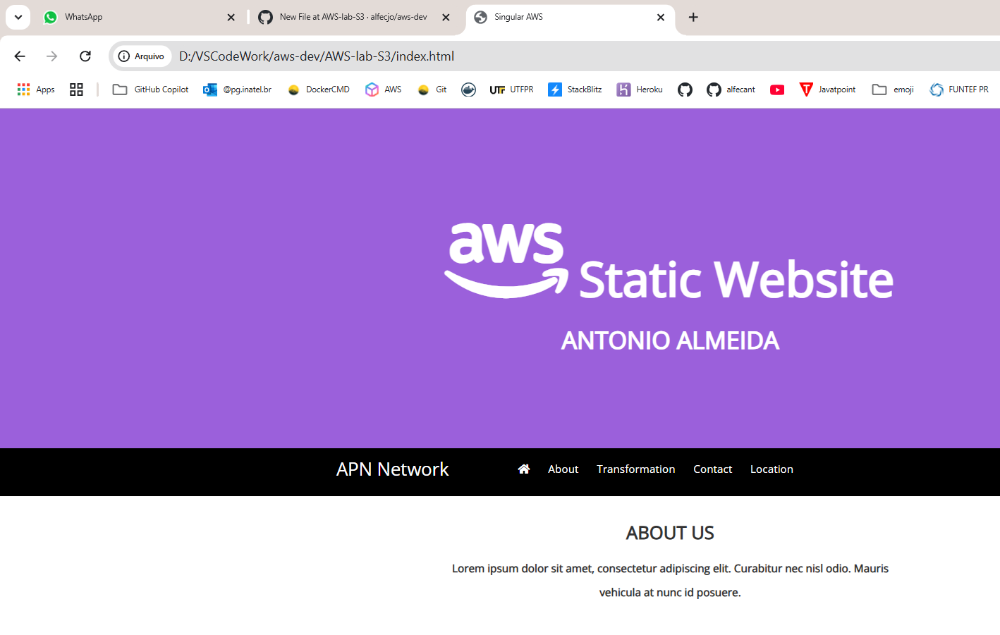

## 🧩 Funcionalidades

- Design responsivo com Bootstrap
- Ícones vetoriais com FontAwesome
- Navegação por âncoras no próprio HTML
- Mapa incorporado via Google Maps
- Link para redes sociais (placeholders)
- Layout moderno, com uso de cores contrastantes e seções bem definidas

## ☁️ Hospedagem no Amazon S3

Para hospedar este site no Amazon S3:

1. Crie um bucket com nome único (ex: `singular-aws-site`).
2. Faça upload dos arquivos: `index.html`, `style.css`, `script.js`.
3. Marque o bucket como **público** e habilite o **hosting de site estático**.
4. Defina `index.html` como documento de entrada (index document).
5. (Opcional) Configure o bucket com **CloudFront** para distribuição global e **SSL (HTTPS)**.
6. Acesse seu site pelo endpoint público fornecido pela AWS.

## 📸 Capturas de Tela

---

- ## Return
  

